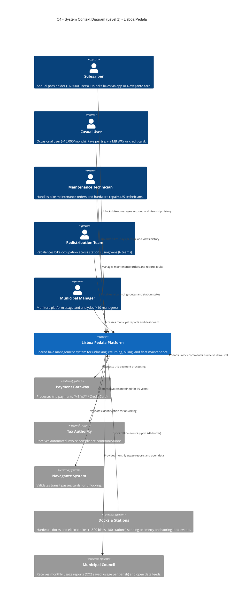

# C4 - System Context Diagram (Level 1)

```mermaid
C4Context
    title C4 - System Context Diagram (Level 1) - Lisboa Pedala

    Person(subscriber, "Subscriber", "Annual pass holder (~60,000 users). Unlocks bikes via app or Navegante card.")
    Person(casual, "Casual User", "Occasional user (~15,000/month). Pays per trip via MB WAY or credit card.")
    Person(tech, "Maintenance Technician", "Handles bike maintenance orders and hardware repairs (25 technicians).")
    Person(van, "Redistribution Team", "Rebalances bike occupation across stations using vans (6 teams).")
    Person(manager, "Municipal Manager", "Monitors platform usage and analytics (~10 managers).")

    System(lisboaPedala, "Lisboa Pedala Platform", "Shared bike management system for unlocking, returning, billing, and fleet maintenance.")

    System_Ext(payment, "Payment Gateway", "Processes trip payments (MB WAY / Credit Card).")
    System_Ext(taxAuth, "Tax Authority", "Receives automated invoice compliance communications.")
    System_Ext(navegante, "Navegante System", "Validates transit passes/cards for unlocking.")
    System_Ext(docks, "Docks & Stations", "Hardware docks and electric bikes (1,500 bikes, 180 stations) sending telemetry and storing local events.")
    System_Ext(council, "Municipal Council", "Receives monthly usage reports (CO2 saved, usage per parish) and open data feeds.")

    Rel(subscriber, lisboaPedala, "Unlocks bikes, manages account, and views trip history")
    Rel(casual, lisboaPedala, "Unlocks bikes, pays per trip, and views history")
    Rel(tech, lisboaPedala, "Manages maintenance orders and reports faults")
    Rel(van, lisboaPedala, "Receives rebalancing routes and station status")
    Rel(manager, lisboaPedala, "Accesses municipal reports and dashboard")

    Rel(lisboaPedala, payment, "Requests trip payment processing")
    Rel(lisboaPedala, taxAuth, "Submits invoices (retained for 10 years)")
    Rel(lisboaPedala, navegante, "Validates identification for unlocking")
    Rel(lisboaPedala, lisboaPedala, "Sends unlock commands & receives bike status/trip events") 
    Rel(docks, lisboaPedala, "Syncs offline events (up to 24h buffer)")
    Rel(lisboaPedala, council, "Provides monthly usage reports and open data")
```
