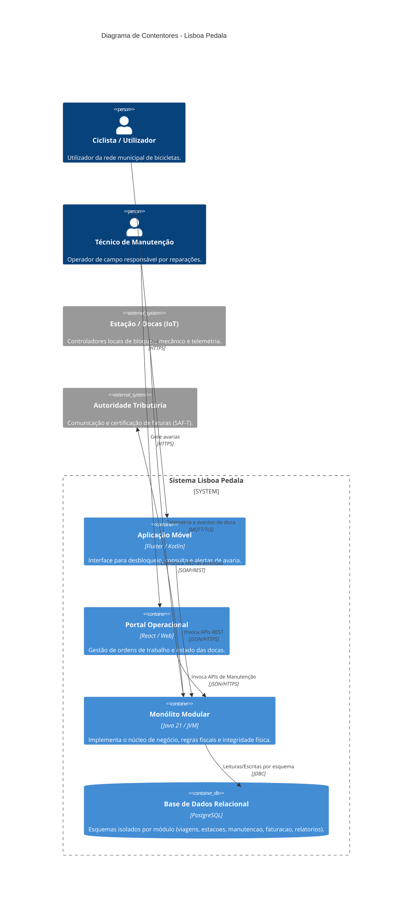

# C4 - Nível 2: Diagrama de Contentores (Container Diagram)

```mermaid
C4Container
    title Diagrama de Contentores - Lisboa Pedala

    Person(utilizador, "Ciclista / Utilizador", "Utilizador da rede municipal de bicicletas.")
    Person(tecnico, "Técnico de Manutenção", "Operador de campo responsável por reparações.")

    System_Boundary(c1, "Sistema Lisboa Pedala") {
        Container(app_movel, "Aplicação Móvel", "Flutter / Kotlin", "Interface para desbloqueio, consulta e alertas de avaria.")
        Container(app_tecnico, "Portal Operacional", "React / Web", "Gestão de ordens de trabalho e estado das docas.")
        Container(backend, "Monólito Modular", "Java 21 / JVM", "Implementa o núcleo de negócio, regras fiscais e integridade física.")
        ContainerDb(db_pedala, "Base de Dados Relacional", "PostgreSQL", "Esquemas isolados por módulo (viagens, estacoes, manutencao, faturacao, relatorios).")
    }

    System_Ext(hardware_estacao, "Estação / Docas (IoT)", "Controladores locais de bloqueio mecânico e telemetria.")
    System_Ext(at, "Autoridade Tributária", "Comunicação e certificação de faturas (SAF-T).")

    Rel(utilizador, app_movel, "Usa", "HTTPS")
    Rel(tecnico, app_tecnico, "Gere avarias", "HTTPS")
    Rel(app_movel, backend, "Invoca APIs REST", "JSON/HTTPS")
    Rel(app_tecnico, backend, "Invoca APIs de Manutenção", "JSON/HTTPS")
    Rel(hardware_estacao, backend, "Telemetria e eventos de doca", "MQTT/TLS")
    Rel(backend, db_pedala, "Leituras/Escritas por esquema", "JDBC")
    Rel(backend, at, "Comunica faturas emitidas", "SOAP/REST")
```
