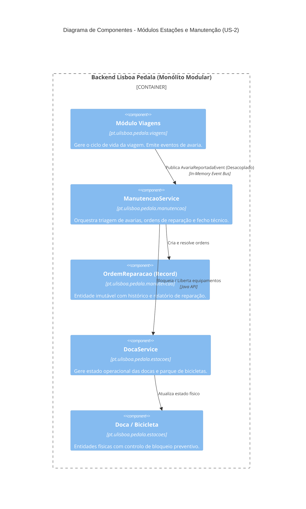

# C4 - Nível 3: Diagrama de Componentes (Módulo Manutenção & Estações)

```mermaid
C4Component
    title Diagrama de Componentes - Módulos Estações e Manutenção (US-2)

    Container_Boundary(backend, "Backend Lisboa Pedala (Monólito Modular)") {
        Component(viagens, "Módulo Viagens", "pt.ulisboa.pedala.viagens", "Gere o ciclo de vida da viagem. Emite eventos de avaria.")
        Component(manutencao_service, "ManutencaoService", "pt.ulisboa.pedala.manutencao", "Orquestra triagem de avarias, ordens de reparação e fecho técnico.")
        Component(ordem_rep, "OrdemReparacao (Record)", "pt.ulisboa.pedala.manutencao", "Entidade imutável com histórico e relatório de reparação.")
        Component(doca_service, "DocaService", "pt.ulisboa.pedala.estacoes", "Gere estado operacional das docas e parque de bicicletas.")
        Component(doca, "Doca / Bicicleta", "pt.ulisboa.pedala.estacoes", "Entidades físicas com controlo de bloqueio preventivo.")
    }

    Rel(viagens, manutencao_service, "Publica AvariaReportadaEvent (Desacoplado)", "In-Memory Event Bus")
    Rel(manutencao_service, doca_service, "Bloqueia / Liberta equipamentos", "Java API")
    Rel(manutencao_service, ordem_rep, "Cria e resolve ordens", "")
    Rel(doca_service, doca, "Atualiza estado físico", "")
```
